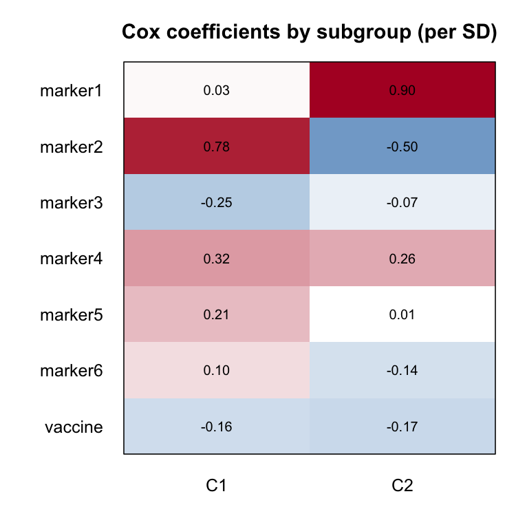

# gemcox: Generative Mixture of Cox Regression (GeM-Cox)

**gemcox** is an R package for finding latent subgroups of people whose
**survival mechanisms** differ: the same biomarkers relate to the risk of
an event (for example infection) differently in different subgroups. It is
the time-to-event counterpart of
[GeMLR](https://github.com/llin-lab/GeMLR), and its workflow follows
GeMLR's.

The model combines a Gaussian mixture model (GMM) for the biomarker
profiles with a Cox proportional hazards model within each subgroup.
Subgroup membership is estimated from both the biomarker profiles and the
observed outcomes.

Version 0.3.0 is for use within the research team; it is not a public
release.

## Installation
------------------------------------------------------------------------

From the shared source file (ask the maintainer for `gemcox_0.3.0.tar.gz`):

```r
install.packages(c("survival", "glmnet", "MASS"))
install.packages("gemcox_0.3.0.tar.gz", repos = NULL, type = "source")
```

Or from a clone of the repository, in the repository root:

```r
install.packages("gemcox", repos = NULL, type = "source")
```

## Example Usage
------------------------------------------------------------------------

This example walks through `gemcox_example`, a **simulated** dataset that
comes with the package. It has 300 subjects, 6 biomarkers, a vaccine
indicator, and time to infection with follow-up to day 150. It contains
two subgroups whose biomarker profiles overlap but whose biomarker-risk
relationships differ, mainly for `marker1` to `marker3`.

### Step 1. Load the package
```r
library(gemcox)
```

### Step 2. Read the data
#### Option A: Read from a file (.csv, .tsv, .txt, .rds, .RData, .xlsx)
```r
# The example data as a CSV file; replace with the path to your own data
f <- system.file("extdata", "gemcox_example.csv", package = "gemcox")
result <- read_data(f,
                    time_col   = "time",     # column with follow-up time
                    status_col = "status",   # column with the event indicator (1 = event)
                    Indi_col   = "vaccine")  # indicator covariate(s), Cox model only
```
#### Option B: Read from a data frame
```r
result <- read_data(gemcox_example, time_col = "time", status_col = "status",
                    Indi_col = "vaccine")
```
**Parameters:**

- `dat_path`: path to a data file with a header row, or a data frame.
- `time_col`, `status_col`: column names or indices of the follow-up time
  and the event indicator (1 = event, 0 = censored).
- `Indi_col`: column(s) of indicator covariates, for example vaccine
  group. They enter the Cox models but not the clustering. Use `NULL` for
  none.
- Every other column is treated as a biomarker. Biomarkers must be numeric
  with no missing values: impute first, and recode text columns, for
  example with `model.matrix()`.

```
# Example data format
> head(result$rawdat)
  vaccine marker1 marker2 marker3 marker4 marker5 marker6    time status
1       0  0.1134 -0.0781  1.4110  0.1227  0.5189  0.0243 144.329      1
2       0  1.1901 -0.0501 -0.4585 -0.2297  1.1354  0.3346  71.870      1
3       0 -1.5954 -0.7642  0.0700  0.0061  0.3124  0.9894 150.000      0
4       1  1.1252  1.6638  0.1581  0.2376  0.0555  0.5004 150.000      0
...
```

### Step 3. Extract Model Inputs

`read_data()` returns a **list**. Unpack it to get the inputs:
```r
dim     <- result$dim      # number of biomarkers (6)
numdata <- result$numdata  # number of subjects (300)
X       <- result$X        # biomarkers (raw scale; gemcox standardises internally)
Xs      <- result$Xs       # standardised biomarkers (for plots and summaries)
time    <- result$time     # follow-up time
status  <- result$status   # event indicator
Indi    <- result$Indi     # indicator covariate(s), or NULL
```

---

## Quick Start: Direct Model Fitting
------------------------------------------------------------------------

If you know the number of subgroups, use `fit_model()`:

```r
fit <- fit_model(
  X = X, time = time, status = status,
  Indi    = Indi,   # covariates for the Cox models only
  K       = 2,      # number of subgroups
  vargmm  = NULL,   # biomarkers for clustering (NULL = all)
  varcox  = NULL,   # biomarkers for the Cox models (NULL = all)
  lambda  = 0.05,   # ridge penalty on the Cox coefficients
  nseeds  = 5,      # number of EM starts (the best is kept)
  verbose = 1
)

summary(fit)            # subgroups, Cox coefficients and their contrast
fit$metrics             # in-sample C-index, effective events per subgroup, convergence
fit$beta_sd             # coefficients per SD of each covariate
plot_beta_heatmap(fit)  # heatmap of the coefficients
```

**Parameters:**

- `K`: number of subgroups (for example 2 or 3).
- `vargmm`: biomarkers (names or indices) used to **define the
  subgroups**. `NULL` = all.
- `varcox`: biomarkers (names or indices) whose **effects on risk** are
  estimated in each subgroup. `NULL` = all.
- `Indi`: covariates such as vaccine group, added to the Cox models only.
- `lambda`: ridge penalty. Increase it (for example to 0.1-0.5) if
  coefficients are unstable with few events.
- `nseeds`: number of EM starts. Use 5-10 for real data, because EM can
  stop at a local optimum.
- `verbose`: `0` = quiet, `1` = report the fit, `2` = also print the EM
  iterations.
- `...`: any other [gemcox()] setting, for example `gamma` or
  `baseline`.

EM runs to convergence (tolerance `1e-8`, at most 1000 iterations). A fit
takes a few seconds at this size.

---

## Full Workflow: Cross-Validation for the Number of Subgroups
------------------------------------------------------------------------

If you do not know the number of subgroups, use cross-validation.

### Step 4. Run Cross-Validation

```r
result_cv <- runCV(
  X = X, time = time, status = status, Indi = Indi,
  ncmp      = 1:3,         # numbers of subgroups to compare (1 = a single Cox model)
  k         = 5,           # number of folds
  criterion = "partial",   # held-out partial likelihood (see below)
  verbose   = 1
)

result_cv$cvLLfinal        # held-out log-likelihood: rows = folds, columns = K
result_cv$mean             # mean over folds (larger is better)
result_cv$best_K
```

**Parameters:**

- `ncmp`: the numbers of subgroups to compare. Include 1 to compare
  against a single Cox model.
- `k`: number of folds, stratified by event status.
- `criterion`:
  - `"partial"` (default) scores each held-out fold by the
    cross-validated Cox partial log-likelihood of Verweij and van
    Houwelingen.
  - `"joint"` also adds how well the biomarker profiles are modelled. It
    tends to count clusters in the biomarker profiles.
- `vargmm`, `varcox`, `lambda`, `nseeds`: as in `fit_model()`.

```
# Example output
> round(result_cv$cvLLfinal, 2)
       cluster=1 cluster=2 cluster=3
1 fold   -177.52   -179.74   -177.12
2 fold   -177.54   -175.28   -177.08
3 fold   -184.33   -179.45   -183.63
4 fold   -178.51   -175.18   -175.47
5 fold   -168.88   -168.14   -167.31
> round(result_cv$mean, 2)
cluster=1 cluster=2 cluster=3
  -177.35   -175.56   -176.12
```

The column with the largest mean is the best number of subgroups (here
K = 2).

*Why not AUC or C-index, as in GeMLR?* The C-index measures how well risk
is ranked, not whether subgroups differ in how biomarkers act. By project
decision it is not used to choose K; the held-out log-likelihood is used
instead. The differences between K are often small and noisy, so read
them together with the test in Step 7.

### Step 5. Fit the Final Model

```r
result_final <- finalModel(
  cv = result_cv,
  X = X, time = time, status = status, Indi = Indi,
  nseeds  = 10,
  verbose = 1
)
result_final$K_selected
summary(result_final)
```

**Note:** `finalModel()` takes the K with the largest mean held-out
log-likelihood from `runCV()` and fits it on all the data.

### Step 6. Visualize Subgroup-Specific Coefficients

```r
# Show the heatmap
plot_beta_heatmap(result_final)

# Save it
plot_beta_heatmap(result_final, output_file = "beta_heatmap.png")
```

The heatmap shows:

* **rows:** covariates (biomarkers, then indicators);
* **columns:** subgroups;
* **colour:** the Cox coefficient per SD of the covariate. Red means
  higher risk; blue means lower risk.

For the example data:



`marker2` raises risk in C1 but lowers it in C2, and `marker1` matters
mainly in C2. Differences like these are what GeM-Cox looks for. In the
simulation that generated the data, the subgroups differ in `marker1` to
`marker3`.

### Step 7. Test for Two Subgroups

```r
ht <- gemcox_heterogeneity_test(result_final, B = 200, seed = 1)
ht$p.value
```

- **What it tests:** whether two subgroups with different Cox coefficients
  fit better than one group with a single Cox model.
- **How:** a likelihood-ratio test. Its reference distribution comes from
  `B` datasets simulated under the fitted one-group model.
- **Run time:** about `2 x B` fits, roughly 5 minutes with `B = 200` at
  this size. `B = 19` gives a quick, coarse answer (smallest p-value
  0.05).
- **A non-significant result is inconclusive.** Power is modest with few
  events. It is not evidence that everyone shares one mechanism.

### Step 8. New Subjects

For a new subject the outcome is unknown, so membership comes from the
biomarkers only:

```r
newX   <- X[1:5, ]                                            # biomarkers of new subjects
newCox <- cbind(X[1:5, ], Indi[1:5, , drop = FALSE])          # their Cox covariates
predict(result_final, newX, newCox, type = "tau")             # membership probabilities
predict(result_final, newX, newCox, type = "survival", times = c(50, 100, 150))
```

---

## Example: Analysis Tasks
------------------------------------------------------------------------

### Task 1: Different biomarkers for clustering and for risk

**Purpose:** define subgroups from some biomarkers, and estimate the
effects of others on risk.

```r
fit_task1 <- fit_model(X, time, status, Indi = Indi, K = 2,
                       vargmm = c("marker4", "marker5", "marker6"),   # define subgroups
                       varcox = c("marker1", "marker2", "marker3"),   # effects on risk
                       nseeds = 5)
summary(fit_task1)
plot_beta_heatmap(fit_task1)
```

### Task 2: Cross-validation with a biomarker subset

```r
result_cv_2 <- runCV(X, time, status, Indi = Indi, ncmp = 1:3, k = 5,
                     vargmm = 1:3, varcox = 1:3)
result_final_2 <- finalModel(result_cv_2, X, time, status, Indi = Indi,
                             vargmm = 1:3, varcox = 1:3)
png("task2_heatmap.png", width = 6, height = 5, units = "in", res = 300)
plot_beta_heatmap(result_final_2)
dev.off()
```

---

## Understanding the Output
------------------------------------------------------------------------

`summary(result_final)` for the example prints:

```
EM: converged after 81 iterations (tol 1e-08); final log-likelihood -3413.816; 10 start(s)
Mean largest membership weight (sharpness): 0.844

Clusters:
 cluster    pi weight_sum eff_events cox_update
      C1 0.568        170       68.7         ok
      C2 0.432        130       75.3         ok

Coefficients (original feature scale):
             C1       C2 C1 - C2
marker1  0.0267  0.92600 -0.8990
marker2  0.7800 -0.50200  1.2800
...
```

- **converged:** must say converged. If not, increase `max_iter` or
  `nseeds`.
- **pi:** the estimated share of subjects in each subgroup.
- **eff_events:** the number of events each subgroup is estimated from.
  Fewer than about 5-10 events per coefficient gives unstable
  coefficients.
- **cox_update:** `ok`, or why that subgroup's Cox fit fell back (for
  example, too few events).
- **Coefficients:** log hazard ratios per unit of each covariate, within
  each subgroup. For example, one unit of `marker2` multiplies the hazard
  by exp(0.78) = 2.2 in C1 and by exp(-0.50) = 0.61 in C2.
- **C1 - C2, the contrast:** the main result. It shows how differently each
  biomarker acts in the two subgroups.
- **sharpness:** the average of each subject's largest membership weight.
  Near 1 means confident assignments; near 0.5 means the subgroups
  overlap.
- **Labels are arbitrary:** C1 in one fit may be C2 in another.
- **No standard errors:** the coefficients are ridge-penalised point
  estimates, and the package does not report standard errors or
  confidence intervals. Use a bootstrap if you need them.

**How to interpret the results**

- **The contrast is the target.** Individual memberships are uncertain
  when subgroups differ mainly in mechanism.
- **Survival comparisons between fitted subgroups are descriptive only.**
  Membership used the outcomes, so differences between the subgroups'
  Kaplan-Meier curves are not evidence of a difference.
- **Keep `gamma = 1`.** It is what lets the outcome separate the
  mechanisms; `gamma = 0` clusters on the biomarkers alone.

**Warnings**

| message | what to do |
|---|---|
| `EM stopped at max_iter ... without meeting tol` | increase `max_iter` (for example 3000) or `nseeds` |
| `numerical guards bound during fitting` | check for extreme values; increase `lambda`; see `fit$guards` |
| `cox_update` not `ok` | use fewer covariates, a larger `lambda`, or a smaller `K` |
| `Missing values in: ...` (from `read_data`) | impute or remove first |

## Using gemcox together with GeMLR
------------------------------------------------------------------------

Both packages export `read_data()`, `fit_model()`, `runCV()`,
`finalModel()` and `plot_beta_heatmap()`. If both are loaded, call them
with the package name, for example `gemcox::fit_model()`. The lower-level
function `gemcox()` gives access to every setting (see `?gemcox` and
`vignette("gemcox-intro")`).

## Status of the evidence
------------------------------------------------------------------------

The package was checked against an extensive simulation study
(`inst/sim/README.md`, `inst/sim/REPORT.md`).

- **With fully converged fits:** using the outcome in membership
  recovered the subgroup contrast better than biomarkers alone in all 12
  scenarios tested.
- **The comparison model:** a latent-class Cox model with logistic
  membership did better when biomarker profiles did not differ, about as
  well with moderate overlap, and slightly worse with strong
  separation.
- **Provisional:** the test's error rate and power were estimated with an
  earlier, looser EM setting and are being re-checked (see `NEWS.md`).

## Citation
------------------------------------------------------------------------

GeM-Cox extends GeM-LR:

[1] Lin, Lin, et al. "GeM-LR: Discovering predictive biomarkers for small
datasets in vaccine studies." PLoS Computational Biology 20.11 (2024):
e1012581.

A GeM-Cox manuscript is in preparation.
